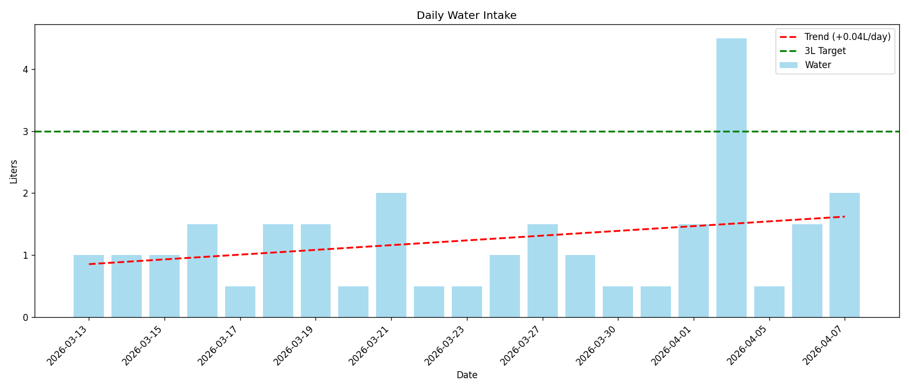

# Nutrition

> Visual targets + charts in the [Fitness dashboard](../../dashboard/index.html).

## Quick Links

- [Meal Plan](./meal-plan.md) — Daily cutting plan with macros
- [High Protein Per Dollar](./high-protein-value.md) — Budget protein options

## Hydration

**Target:** 3,000 mL (3L) per day

## Daily targets — live store vs this page

**Live applied targets** are `targets.json` (FitDash Kitchen + meal planner + calorie pacing + 7d adherence). Do not treat the April table below as current.

**Coach-owned recommendations (v1 shipped):** recommended kcal/macros come from `recommend_nutrition_targets` (goal vs current weight, wearable TDEE, recovery, adherence). Applied values change only on explicit apply. Contract: [COACH_TARGETS.md](./COACH_TARGETS.md).

### Historical note (CUTTING — Apr 23, 2026)

> Weight gain +4.4 lbs (Jan–Apr) indicated ~570 cal/day surplus. Target was adjusted to 1,700 cal/day on paper. That number is **not** what FitDash applies today.

| Metric | Then | Notes |
|--------|------|-------|
| Calories | **1,700** | Down from 2,200 (deficit mode) |
| Protein | 200g+ | Keep high |
| Carbs | ~150g | Lower to hit calorie target |
| Fat | ~45g | Keep moderate |

**Then expected:** ~1 lb/week weight loss.

## Dashboard inventory & meal planning

| File | Purpose |
|------|---------|
| `inventory.json` | Curated ingredients you currently have (add/remove from dashboard) |
| `targets.json` | **Applied** daily calorie + macro targets (SoT for pacing, remaining, meal plan, adherence) |
| `COACH_TARGETS.md` | How the coach layer *recommends* those targets from goals vs data |

The resistance dashboard reads today's intake from Google Health, compares to **applied** `targets.json`, and builds a plan from **in-stock** items in `inventory.json`. Recommendations must not silently overwrite that file.
