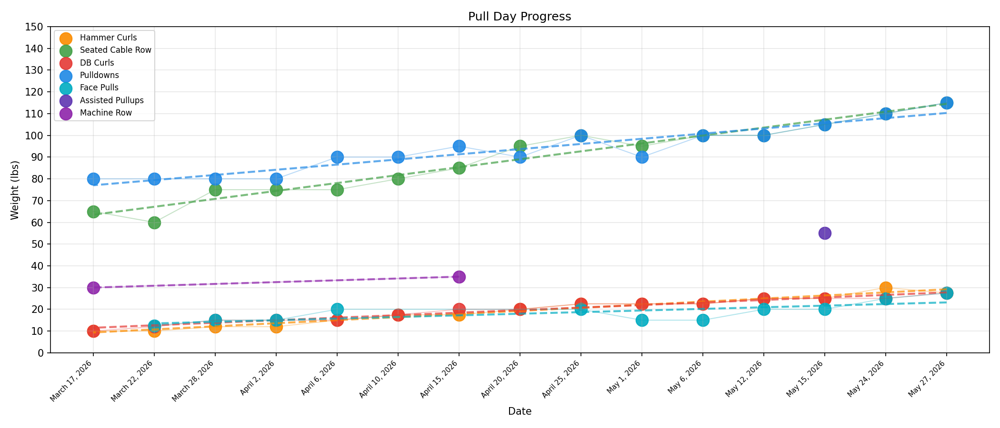
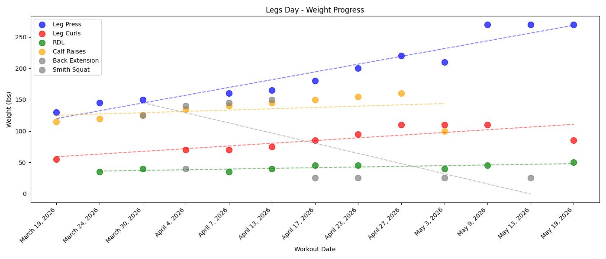
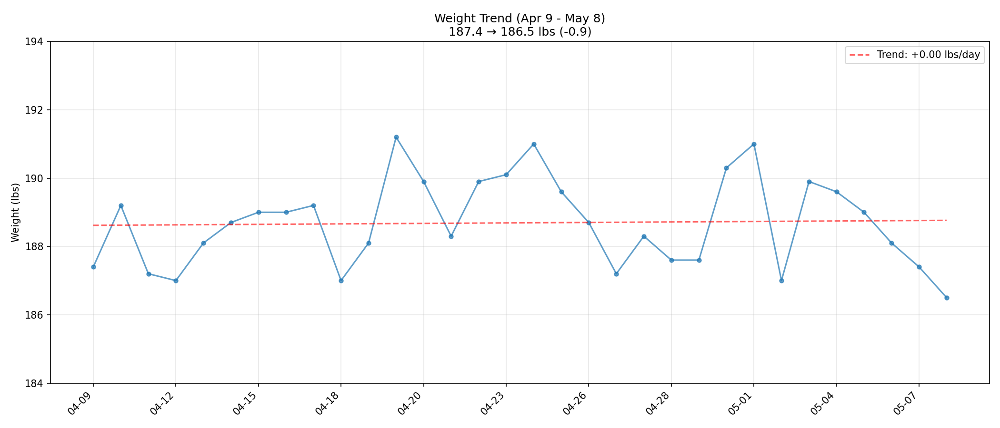
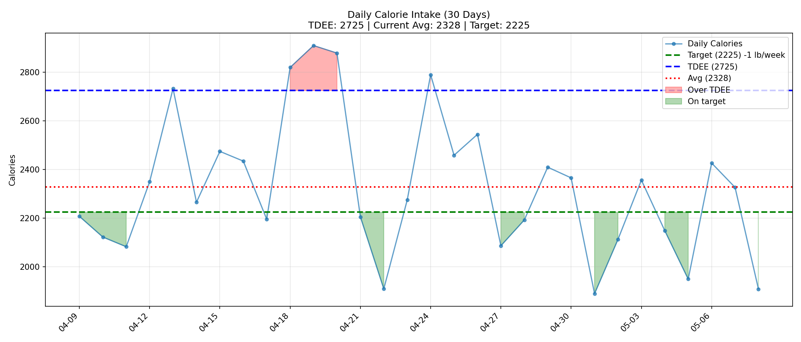
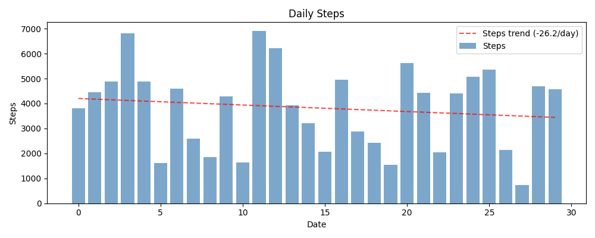
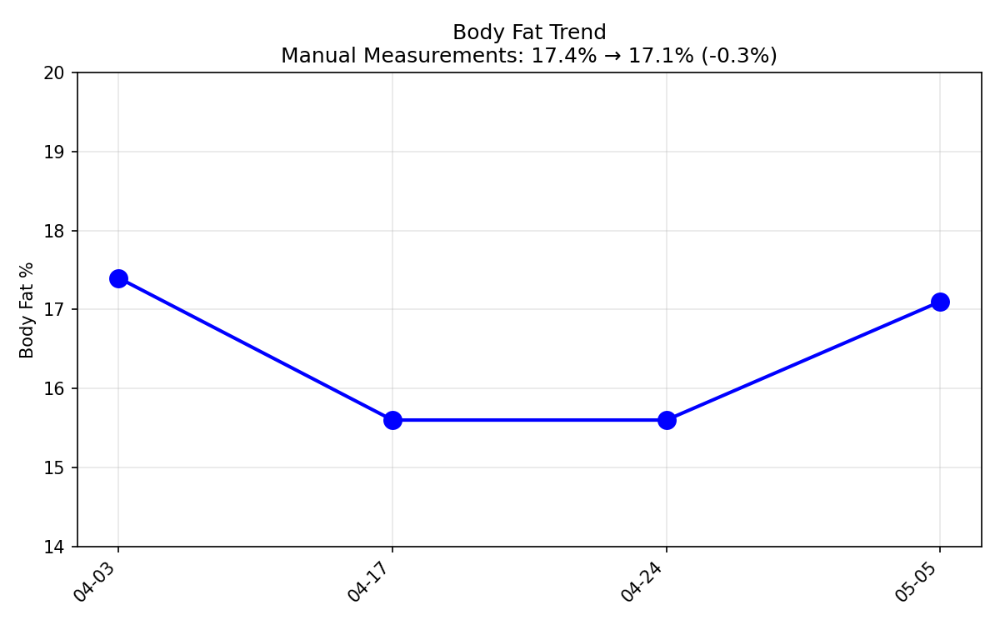

# Workouts

> Visual version: [../../dashboard/index.html](../../dashboard/index.html) (Fitness section) — charts + latest sessions.

## Daily Routines

- [Push Day](./push.md) — Chest / Shoulders / Triceps
- [Pull Day](./pull.md) — Back / Biceps  
- [Legs Day](./legs.md) — Quads / Hamstrings / Calves

## Progress Charts

## Body Metrics

### Body Fat

## PPLR Rotation

**Rule:** Only rest after 3 straight workout days.

| Day | Workout |
|-----|----------|
| 1 | Push |
| 2 | Pull |
| 3 | Legs |
| 4 | Rest |
| 5 | Repeat |

## Daily (Non-Gym)

- **Ab Wheel:** every calendar day
- **Pushups:** 5-10 daily (morning reminder)

---

## 📋 Workout Notes & Tips

### Pre-Workout
- **Pre-workout meal** - Eat within ~1 hour of training for energy

### In-Session
- **Mind-muscle connection** - Focus on form over weight
- **Control** - Slow, deliberate reps

### Exercise Notes
- **DB Shoulder Press** - Go first in push days, aim for 35×12×3
- **Face Pulls** - Drop set for higher reps
- **RDLs** - Do first in legs day

### Post-Workout
- **BE FULLY RESTED** - Leg day requires full recovery

### Program Notes
- **Deload** - When feeling fatigued, lower weight, higher reps
- **Next push: deload** - Scheduled recovery
- **Progressive overload** - Same reps at heavier weight OR more reps at same weight

---

*Notes compiled from workout logs - Updated May 21, 2026*