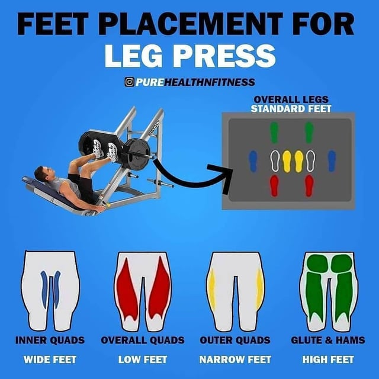

# Legs Day

## May 25, 2026 - Session Complete
- Laying Leg Curls: 75 lbs x 1 x 15, 70 lbs x 1 x 15, 70 lbs x 1 x 12
- Leg Press: 280 lbs x 1 x 8, 275 lbs x 1 x 10, 270 lbs x 1 x 12 (PR!)
- Hip Abductions: 115 lbs x 2 x 15
- Hip Adductions: 115 lbs x 2 x 15

## May 19, 2026 - Session Complete
- Leg Press: 270 lbs x 3 x 8 (PR!)
- RDLs: 50 lbs x 1 x 8, 50 lbs x 1 x 6, 45 lbs x 1 x 10
- Seated Leg Curls: 85 lbs x 3 x 12
## May 13, 2026 - Session Complete
- - Leg Press: 270 lbs x 1 x 6, 230 lbs x 1 x 8, 220 lbs x 1 x 10
Note: BE FULLY RESTED
## May 9, 2026 - Session Complete
- RDLs: 45 lbs x 10 x 3
- Leg Press: 270 lbs x 6 x 3
- Seated Leg Curls: 110 lbs x 12 x 3

## May 3, 2026 - Session Complete
- - RDLs: 40 lbs x 3 x 15
- Leg Press: 210 lbs x 2 x 10, 210 lbs x 1 x 8
- Seated Leg Curls: 110 lbs x 3 x 8
- Calf Raises: 100 lbs x 3 x 20

## April 27, 2026 - Session Complete
**Note:** Do RDLs first next workout
- Leg Press: 220 lbs x 1 x 10, 210 lbs x 2 x 10 (PR!)
- Seated Leg Curls: 110 lbs x 1 x 8, 105 lbs x 1 x 12, 100 lbs x 1 x 15 (PR!)
- Calf Raises: 160 lbs x 1 x 14, 155 lbs x 1 x 20
- RDL: Skipped (do first next time)

## April 23, 2026 - Session Complete
- - Seated Leg Curls: 95 lbs x 1 x 12, 90 lbs x 1 x 15, 85 lbs x 1 x 15 (PR!)
- Leg Press: 200 lbs x 1 x 12, 190 lbs x 1 x 12, 180 lbs x 1 x 12 (PR!)
- RDL: 45 lbs x 1 x 12
- Calf Raises: 155 lbs x 3 x 18 (PR!)

## April 17, 2026 - Session Complete
- RDL: 45 lbs x 3 x 10 (PR!)
- : 25 lbs x 3 x 10
- Leg Press: 180 lbs x 1 x 8, 175 lbs x 1 x 10, 170 lbs x 1 x 12 (PR!)
- Calf Raises: 150 lbs x 2 x 20, 150 lbs x 1 x 15 (PR!)
- Seated Leg Curls: 85 lbs x 1 x 10, 85 lbs x 1 x 8 (PR!)

## April 13, 2026 - Session Complete
- Back Extension Machine: 150 lbs x 3 x 15 (PR!)
- RDL: 40 lbs x 3 x 15 (PR!)
- Leg Press: 165 lbs x 3 x 10 (PR!)
- Calf Raises: 145 lbs x 3 x 20 (PR!)
- Seated Leg Curls: 75 lbs x 3 x 10 (PR!)

## April 7, 2026 - Session Complete
- RDL: 35 lbs x 1 x 15, 40 lbs x 2 x 12
- Back Extension Machine: 145 lbs x 3 x 15 (PR!)
- Leg Press: 160 lbs x 3 x 12
- Seated Leg Curls: 70 lbs x 1 x 15, 75 lbs x 2 x 6
- Calf Raises: 140 lbs x 3 x 15

## April 4, 2026 - Session Complete
- Smith Squat: 40 lbs x 2 x 10, 60 lbs x 1 x 3
- Calf Raises: 135 lbs x 2 x 20, 135 lbs x 1 x 13
- Leg Press: 155 x 10, 160 x 10, 165 x 10 (PR!)
- Seated Leg Curls: 70 lbs x 3 x 12
- Back Extension Machine: 140 lbs x 3 x 15 (PR!)

## March 30, 2026 - Session Complete
- Leg Press: 150 lbs x 3 x 10 (PR!)
- Seated Leg Curls: NOT DONE (machine being repaired)
- RDL: 40 lbs x 3 x 12
- Calf Raises: 125 lbs x 3 x 20 (PR!)
- Back Extension Machine: 125 lbs x 3 x 15

## March 24, 2026 - Session Complete
- Leg Press: 145 lbs x 3 x 10 (PR!)
- Seated Leg Curls: NOT DONE (machine being repaired)
- RDL: 40 → 40 → 35 lbs x 10/12
- Calf Raises: 120 lbs x 20

**Next session:** Consider Smith Squat for glute focus (alternate with leg press)

## March 19, 2026 - Session Complete
- Leg Press: 140 lbs x 3 x 10 (PR!)
- Seated Leg Curls: 70 lbs x 3 x 15
- RDL: 45 → 40 → 40 x 8
- Calf Raises: 115 lbs x 3 x 15

### Previous (Mar 13)
- Leg Press: 130 lbs
- Seated Leg Curls: 55 lbs
- RDL: skipped
- Calf Raises: 115 lbs

### Glute-Focused Additions (Mar 30+)
- Smith Barbell Squat - Wide stance, push knees out - 3 x 8-12
- DB Sumo Squats - Wide stance, hold DB at chest - 3 x 10-12
- Cable Goblet Squats - Cable machine, rope attachment at chest - 3 x 10-12

---

## Exercise Directory

### Quads
- Leg Press
- Leg Extension (if added)
- Smith Squat (if added)

### Hamstrings
- RDL (Romanian Deadlift)
- Leg Curls
- Good Mornings (if added)

### Glutes
- RDL
- Hip Thrust (if added)
- Bulgarian Split Squat (if added)

### Hip Flexors / Adductors (Supplemental)
- Hip Flexor Stretches
- Cable Adduction (if added)

### Lower Back
- Back Extension Machine
- Back Extension Freeweight (added April 2026)

### Calves
- Calf Raises (Seated/Standing)

### Core / Abs (Supplemental)
- Cable Crunches
- Hanging Leg Raises

---

## Leg Press Form Guide

*Source: Reddit Fitness Community*
