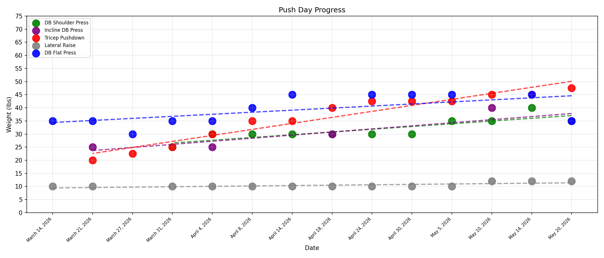

# Push Day (Chest / Shoulders / Triceps)

## May 26, 2026 - Session Complete
- DB Flat Press: 50 lbs x 1 x 12, 45 lbs x 1 x 12, 40 lbs x 1 x 12
- Tricep Pushdowns: 47.5 lbs x 3 x 12 (PR!)
- DB Shoulder Press: 40 lbs x 1 x 5, 35 lbs x 1 x 10, 35 lbs x 1 x 8, 30 lbs x 1 x 12
- Lateral Raises: 15 lbs x 2 x 8, 15 lbs x 1 x 6

Notes:
- Next session: DB Shoulder Press first, aim for higher reps at end sets
- Add Smith Shrugs next time (start 180-225 lbs)
- Add Y Raises: https://youtu.be/fTwT5vyUkHc
## Trendline Analysis

| Exercise | Slope (lbs/date) | Approx Monthly Change |
|----------|------------------|---------------------|
| Tricep Pushdown | +2.29 | +9.9 lbs/mo |
| DB Incline Press | +1.18 | +5.1 lbs/mo |
| DB Shoulder Press | +1.05 | +4.5 lbs/mo |
| DB Flat Press | +0.78 | +3.4 lbs/mo |
| Lateral Raise | +0.15 | +0.6 lbs/mo |

## May 20, 2026 - Session Complete
- DB Shoulder Press: 35 lbs x 3 x 12 (PR!)
- DB Incline Press: 35 lbs x 1 x 12, 35 lbs x 1 x 10, 35 lbs x 1 x 8
- Tricep Pushdowns: 47.5 lbs x 3 x 10 (PR!)
- Lateral Raises: 12 lbs x 3 x 16
- DB Flat Press: 35 lbs x 3 x 10
- Note: Pre-workout meal within 1 hour | Felt low energy/plateaued - monitor, may need more pre-workout cals soon
## May 14, 2026 - Session Complete
- DB Flat Press: 45 lbs x 3 x 12 (PR!)
- Tricep Pushdowns: 45 lbs x 3 x 15 (PR!)
- DB Shoulder Press: 40 lbs x 1 x 6, 35 lbs x 1 x 10, 35 lbs x 1 x 8
- Lateral Raises: 12 lbs x 3 x 15

Note: Next push - DB Shoulder Press first, go for 35 lbs x 12 x 3
## May 10, 2026 - Session Complete
- DB Incline Press: 40 lbs x 1 x 10, 40 lbs x 1 x 8, 35 lbs x 1 x 12
- Tricep Pushdowns: 45 lbs x 1 x 10, 42.5 lbs x 1 x 15, 42.5 lbs x 1 x 14 (PR!)
- DB Shoulder Press: 35 lbs x 2 x 12, 35 lbs x 1 x 10
- Lateral Raises: 12 lbs x 2 x 16, 12 lbs x 1 x 12
## May 5, 2026 - Session Complete
- DB Flat Press: 45 lbs x 2 x 10, 40 lbs x 1 x 12
- Tricep Pushdowns: 42.5 lbs x 1 x 12, 42.5 lbs x 1 x 11, 42.5 lbs x 1 x 10
- DB Shoulder Press: 35 lbs x 3 x 8 (PR!)
- Lateral Raises: 10 lbs x 1 x 20, 10 lbs x 1 x 19, 10 lbs x 1 x 16

Note: Next push - deload
## April 30, 2026 - Session Complete
- DB Flat Press: 45 lbs x 1 x 10, 45 lbs x 2 x 8
- Tricep Pushdowns: 42.5 lbs x 1 x 12, 42.5 lbs x 1 x 10, 42.5 lbs x 1 x 8
- DB Shoulder Press: 30 lbs x 3 x 12
- Lateral Raises: 10 lbs x 3 x 16

**Note:** Next push - deload (lower weight, higher reps)
## April 24, 2026 - Session Complete
- DB Shoulder Press: 30 lbs x 3 x 10
- Tricep Pushdowns: 42.5 lbs x 1 x 10, 42.5 lbs x 1 x 9, 42.5 lbs x 1 x 8 (PR!)
- DB Flat Press: 45 lbs x 1 x 6, 40 lbs x 2 x 12
- Lateral Raises: 10 lbs x 3 x 15
## April 18, 2026 - Session Complete
- DB Incline Press: 30 lbs x 1 x 15, 35 lbs x 1 x 12, 35 lbs x 1 x 10 (PR!)
- DB Shoulder Press: 30 lbs x 1 x 8, 30 lbs x 1 x 6, 25 lbs x 1 x 8
- Tricep Pushdowns: 40 lbs x 1 x 15, 40 lbs x 1 x 14, 40 lbs x 1 x 12 (PR!)
- Lateral Raises: 10 lbs x 1 x 20, 10 lbs x 1 x 18, 10 lbs x 1 x 16
## April 14, 2026 - Session Complete
- DB Flat Press: 45 lbs x 3 x 10 (PR!)
- Tricep Pushdown: 35 lbs x 3 x 16 (PR!)
- DB Shoulder Press: 30 lbs x 3 x 10 (PR!)
- Lateral Raises: 10 lbs x 2 x 20, 10 lbs x 1 x 16

## April 8, 2026 - Session Complete
- DB Flat Press: 40 lbs x 3 x 12 (PR!)
- Tricep Pushdown: 35 lbs x 3 x 15 (PR!)
- DB Shoulder Press: 30 lbs x 2 x 10, 30 lbs x 1 x 6
- Pec Flies: 15 lbs x 3 x 15 (NEW!)
- Lateral Raises: 10 lbs x 3 x 15

## April 4, 2026 - Session Complete
- DB Flat Press: 35 lbs x 1 x 12, 40 lbs x 2 x 10
- Tricep Pushdowns: 30 lbs x 3 x 15 (PR!)
- DB Shoulder Press: 30 lbs x 1 x 8, 25 lbs x 1 x 12, 25 lbs x 1 x 10
- Lateral Raises: 10 lbs x 2 x 15, 10 lbs x 1 x 12
- DB Incline Press: 25 lbs x 3 x 10 (from previous)

## March 31, 2026 - Session Complete
- DB Flat Press: 35 lbs x 3 x 10
- Tricep Pushdowns: 25 lbs x 3 x 15 (PR!)
- DB DB Shoulder Press: 25 lbs x 3 x 10 (PR!)
- Lateral Raises: 10 lbs x 3 x 12

## March 27, 2026 - Session Complete
- Tricep Pushdowns: 22.5 lbs x 3 x 15 (PR!)
- DB Flat Press: 40 → 35 → 30 lbs x 10
- Smith Bench: 50 lbs x 3 x 10

## March 21, 2026 - Session Complete
- DB Incline Press: 25 lbs x 3 x 10
- Tricep Pushdowns: 20 lbs x 3 x 15
- Lateral Raises: 10 lbs x 3 x 12
- DB Flat Press: 35 lbs x 3 x 10

## March 14, 2026 - Session Complete
- Smith Bench: 45 lbs x 3 x 10
- DB Flat Press: 35 lbs x 3 x 10
- Lateral Raises: 10 lbs x 3 x 12

---

## Exercise Directory

### Chest
- DB Flat Press
- Pec Flies  
- DB Incline Press
- Smith Bench
- Cable Flyes (to add)
- Pushups (to add)
- Machine Chest Press (to add)

### Shoulders
- Shoulder Press
- Lateral Raises
- Face Pulls (Rear Delt - supplemental, usually done on Pull)

### Triceps
- Tricep Pushdown
- Skull Crushers (if added)

### Core / Abs (Supplemental)
- Cable Crunches
- Hanging Leg Raises
- Planks

- Smith Shrugs: _ lbs x 3 x _ (to be added)

## Trendline Analysis

| Exercise | Slope (lbs/date) | Approx Monthly Change |
|----------|------------------|----------------------|
| DB Flat Press | +0.78 | +3.4 lbs/mo |
| DB Shoulder Press | +1.05 | +4.5 lbs/mo |
| DB Incline Press | +1.18 | +5.1 lbs/mo |
| Lateral Raise | +0.15 | +0.6 lbs/mo |
| Tricep Pushdown | +2.29 | +9.9 lbs/mo |
